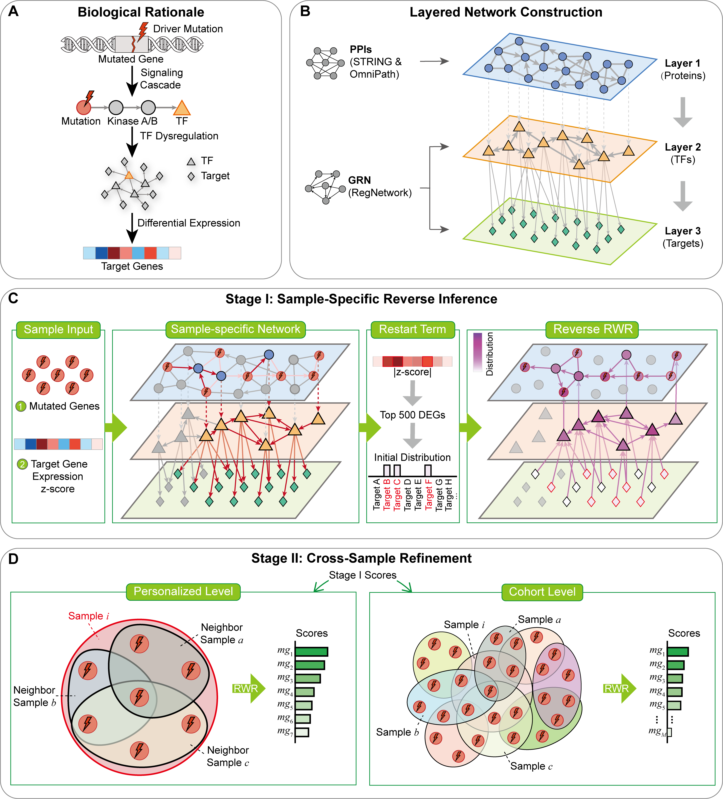

# 🔬 HyperNetWalk

**HyperNetWalk** is an **unsupervised** framework that unifies **personalized (individual)** and **cohort-level** cancer driver gene identification within a single inference architecture.

It constructs a **layered signaling–regulatory network** that separates upstream signaling, modeled by a **protein–protein interaction (PPI)** network, from downstream transcriptional regulation, modeled by a **gene regulatory network (GRN)**, with **transcription factors (TFs)** bridging the two as shared nodes. Driver gene identification is then formulated as an **inverse problem**: rather than propagating perturbation signals forward from mutations, HyperNetWalk traces observed transcriptional dysregulation *back* to its upstream causal mutations through **reverse random walk** on this layered structure.

The resulting sample-specific scores serve as a shared foundation for both prediction levels — used as informed node weights for cross-sample refinement via **hypergraph random walks**, which operate on a sample-specific hypergraph for personalized prediction and on a global hypergraph for cohort-level prediction. The method was evaluated across **12 TCGA cancer types**, outperforming existing methods at both levels.

> 📄 *HyperNetWalk: A Unified Framework for Personalized and Cohort-Level Cancer Driver Gene Identification via Reverse Inference on a Layered Signaling–Regulatory Network.*

[](LICENSE)
[](https://cran.r-project.org/)

<p align="center">
  
</p>

<p align="center">
  <em>Overview of HyperNetWalk: biological rationale and layered signaling–regulatory network construction (top); per-sample reverse random walk with restart on the layered network (middle); and hypergraph random walk refinement at the personalized and cohort levels (bottom).</em>
</p>

---

## 📋 Table of Contents

- [1. Requirements](#1-requirements)
- [2. Data Availability](#2-data-availability)
- [3. Quick Start — Run on Your Own Data](#3-quick-start--run-on-your-own-data)
- [4. Input & Output Formats](#4-input--output-formats)
- [5. Parameters](#5-parameters)
- [6. Reproducing the Paper](#6-reproducing-the-paper)
- [7. Repository Structure](#7-repository-structure)
- [8. Experiments & Figures](#8-experiments--figures)
- [9. Benchmark Methods](#9-benchmark-methods)
- [10. Citation](#10-citation)
- [11. 中文说明](#11-中文说明)

---

## 🧩 1. Requirements

HyperNetWalk runs as a set of R scripts — no conda/`renv` setup is needed, just an R installation with the required packages.

- **R**: 4.4.3 recommended (other 4.4.x versions are likely fine)

**Install dependencies:**

```r
# --- CRAN packages ---
install.packages(c(
  "aricode", "Cairo", "cluster", "data.table", "doSNOW", "dplyr",
  "forcats", "foreach", "ggplot2", "ggpubr", "ggsci", "ggvenn",
  "igraph", "Matrix", "mclust", "msigdbr", "patchwork", "pROC",
  "progress", "purrr", "RColorBrewer", "readr", "reshape2", "Rtsne",
  "scales", "stringr", "survival", "survminer", "tibble", "tidyr", "umap"
))

# --- Bioconductor packages ---
if (!requireNamespace("BiocManager", quietly = TRUE)) install.packages("BiocManager")
BiocManager::install(c(
  "clusterProfiler", "ConsensusClusterPlus", "fgsea", "TCGAbiolinks", "WGCNA"
))
```

> The core model (`model.R`) only needs a subset of these (`Matrix`, `igraph`, `data.table`, `dplyr`, `readr`, `purrr`, `WGCNA`, `foreach`, `doSNOW`, `progress`). The remaining packages are used by the analysis/plotting scripts (`exp*.R`, `plot_formal.R`).

---

## 📦 2. Data Availability

The code lives on GitHub, but the large omics and network files are **not** stored in the repository (they exceed GitHub's 100 MB per-file limit). They are archived on **Zenodo**:

> **Zenodo DOI:** [10.5281/zenodo.20627042](https://doi.org/10.5281/zenodo.20627042) &nbsp;|&nbsp; **Download:** https://doi.org/10.5281/zenodo.20627042

The archive is split into three packages; download what you need and unzip into `data/`:

| Package | Contents | Unzip to | Needed for |
|---|---|---|---|
| `network_reference.zip` | PPI / GRN / TF–target networks and gene annotation (`STRINGv12.txt`, `9606.protein.links.v12.0.onlyAB.tsv`, `RegNet_human_V2.txt`, `gencode.v36.annotation.gtf.gene.probemap`, `omnipath_interactions.tsv`) | `data/` | **Required** to run the model |
| `processed_data.zip` | Preprocessed model inputs for the 12 cancer types | `data/processed_data/` | Running / reproducing without re-preprocessing |
| `rawdata.zip` | TCGA raw files per cancer type | `data/rawdata/` | Full reproduction from raw data |

```bash
# Example: fetch and extract the required reference files
unzip network_reference.zip -d data/
# Optional, for reproduction:
unzip processed_data.zip -d data/
unzip rawdata.zip -d data/
```

> Outputs such as `results/` and benchmark run products (e.g. `benchmark/PersonaDrive/graphs/`) are **regenerated by running the pipeline** and are therefore neither tracked in Git nor included in the Zenodo archive.

---

## 🚀 3. Quick Start — Run on Your Own Data

You do **not** need the TCGA pipeline to apply HyperNetWalk. The model entry point is the `run_hypernetwalk()` function in `model.R`, which takes a **mutation matrix** and an **expression matrix** for your own cohort and produces both personalized and cohort-level driver gene rankings.

```r
# Run from the repository root (model.R loads reference files via ./data/...)
source("model.R")

run_hypernetwalk(
  cancer_type   = "MyDataset",                 # any label; names the output subfolder
  mut_data_file = "path/to/mut_data.tsv",      # binary gene × sample mutation matrix
  exp_data_file = "path/to/exp_tpm_data.tsv",  # gene × sample expression matrix (TPM)
  output_dir    = "results/MyDataset",
  num_cores     = 8                            # lower this to match your machine
)
```

This single call runs both stages — the per-sample reverse random walk, then the hypergraph refinement — and writes the personalized and cohort rankings (see [§3](#3-input--output-formats)).

> **Prerequisites — keep these reference files in `./data/`.** Download them from [Data Availability](#2-data-availability) (`network_reference.zip`) if you don't already have them. The model loads them by relative path, so run from the repository root and make sure the following exist:
> - `data/gencode.v36.annotation.gtf.gene.probemap` — gene-length annotation
> - `data/STRINGv12.txt` — PPI network
> - `data/RegNet_human_V2.txt` — gene regulatory network (TF–target)
> - `data/omnipath_interactions.tsv` — directed interactions merged with STRING
>
> Your genes must use the **same gene-symbol namespace (HGNC symbols)** as these reference files.

---

## 📥 4. Input & Output Formats

### Input

Both inputs are **tab-separated** text files with **genes in rows** and **samples in columns**: the first column holds gene symbols (used as row names) and the header row holds sample IDs. The simplest way to get the format right is to mirror the example files in `data/processed_data/<CANCER_TYPE>/` (`mut_data.tsv`, `exp_tpm_data.tsv`).

| File | Values | Notes |
|---|---|---|
| Mutation matrix | Binary `0`/`1` (1 = gene mutated in that sample) | Samples with fewer than 3 mutated genes are dropped |
| Expression matrix | TPM | Genes expressed (≥1) in fewer than 20% of samples are dropped |

> ⚠️ **Important — sample naming.** Sample columns are filtered by **TCGA barcode suffix**, and this matters even for non-TCGA data:
> - Mutation samples are kept only if the column name ends in `-01A` or `-01` (primary tumor).
> - Expression samples are kept if the name ends in `-01A`/`-01` (tumor) or `-11A`/`-11` (matched normal).
> - Sample IDs are then truncated to the **first 12 characters** to match mutation ↔ expression.
>
> So for your own data, name tumor samples `<ID>-01` and any matched normals `<ID>-11`, where `<ID>` is a shared identifier of ≤12 characters. **Samples without a recognized suffix are discarded** — if none match, the run fails on an empty matrix. (Alternatively, edit the regex in `get_mut_data()`, `get_exp_data()`, and `get_objs()` in `model.R`.)
>
> **Normal samples are optional but recommended.** With ≥2 normal (`-11`) samples, differential expression is computed as a tumor-vs-normal z-score; otherwise a tumor-only z-score is used.

### Output

Results are written to `output_dir/<cancer_type>/`:

| File | Level | Content |
|---|---|---|
| `genes_ranking.txt` | Personalized | One row per sample: `sample_id <TAB> comma-separated ranked genes` (highest priority first) |
| `genes_ranking_cohort.txt` | Cohort | `gene <TAB> score`, ranked in descending order |
| `results.Rdata` | — | Full R object (`objs`) with intermediate matrices and scores |

---

## ⚙️ 5. Parameters

`run_hypernetwalk()` accepts the following arguments (the first four are required; the rest reproduce the paper defaults):

| Argument | Default | Description |
|---|---|---|
| `cancer_type` | — | Label for the run; names the output subfolder |
| `mut_data_file` | — | Path to the mutation matrix |
| `exp_data_file` | — | Path to the expression matrix |
| `output_dir` | — | Output directory |
| `k` | `100` | Gene-length normalization scale |
| `l0` | `100000` | Gene-length threshold below which the length factor is 1 |
| `max_degs` | `500` | Maximum number of DEGs per sample used as restart sources in the reverse walk |
| `delta` | `0.1` | Hypergraph edge-weighting parameter |
| `theta` | `0.85` | Random-walk retention probability (the restart probability is `1 - theta`) |
| `ifparallel` | `TRUE` | Enable parallel processing |
| `num_cores` | `50` | Number of cores when running in parallel — **lower to match your machine** |

See the paper for the full definitions of `delta` and `theta`.

### Runtime & resources

HyperNetWalk is parallelized across samples (`ifparallel = TRUE`). As a reference point, a single cancer type of **~950 samples (BRCA)** completes in **about 6 minutes on 50 cores**. Runtime scales roughly with the number of samples and the number of available cores, so reduce `num_cores` to match your machine — smaller cohorts will be correspondingly faster.

---

## 🔁 6. Reproducing the Paper

To reproduce the 12-cancer-type TCGA results from the paper:

**Step 1 — Preprocess raw data and networks** (produces `data/processed_data/` and the network files):

```bash
Rscript data_preprocess.R
Rscript network_preprocess.R
```

**Step 2 — Run HyperNetWalk on all 12 cancer types:**

```bash
Rscript run_hypernetwalk.R
```

`run_hypernetwalk.R` loops over the 12 cancer types (BRCA, COAD, HNSC, KIRC, KIRP, LIHC, LUAD, LUSC, PRAD, STAD, THCA, UCEC), reading `data/processed_data/<CANCER_TYPE>/{mut_data.tsv, exp_tpm_data.tsv}` and writing to `results/HyperNetWalk/<CANCER_TYPE>/`.

**Step 3 — Run baselines (optional):**

```bash
Rscript baseline.R
```

---

## 📁 7. Repository Structure

```
HyperNetWalk/
├── model.R                  # Core HyperNetWalk model — defines run_hypernetwalk()
├── run_hypernetwalk.R       # Reproduce paper: loops the 12 TCGA cancer types
├── data_preprocess.R        # Preprocess TCGA raw data → processed_data/
├── network_preprocess.R     # Build / clean PPI, GRN, and TF–target networks
├── baseline.R               # Baseline / simple comparison methods
├── exp1_benchmark.R         # Experiment 1: benchmark comparison
├── exp2_ablation.R          # Experiment 2: ablation study
├── exp3_cancerspecific.R    # Experiment 3: cancer-specificity analysis
├── exp4_biological.R        # Experiment 4: biological validation
├── exp5_clinical.R          # Experiment 5: clinical analysis
├── plot_formal.R            # Final figure generation
│
├── data/                    # Input data (omics + networks); see below
│   ├── rawdata/             # TCGA raw files per cancer type
│   ├── processed_data/      # Preprocessed inputs per cancer type (model input)
│   ├── STRINGv12.txt        # STRING v12 PPI network
│   ├── RegNet_human_V2.txt  # RegNetwork GRN
│   └── ...                  # TF–target, probemap, drug associations, etc.
├── reference_dg/            # Reference driver-gene annotations (CGC, IntOGen, NCG, ...)
├── benchmark/               # Individual-level competing methods (source code)
├── benchmark_cohort/        # Cohort-level competing methods (source code)
├── results/                 # Ranking outputs for all methods × 12 cancer types
├── figs/                    # Figures (exp1–exp5); editable .ai source files are not tracked
├── assets/                  # README assets (overview figure)
└── README.md
```

The `data/` directory holds the omics inputs and the reference networks. The model requires `gencode.v36.annotation.gtf.gene.probemap`, `STRINGv12.txt`, `RegNet_human_V2.txt`, and `omnipath_interactions.tsv` (see [§2](#2-quick-start--run-on-your-own-data)); `reference_dg/` holds driver-gene lists (CGC, IntOGen, NCG, etc.) used for evaluation.

> **Note on large files.** Raw TCGA files, full networks, and preprocessed inputs are hosted on Zenodo rather than Git — see [Data Availability](#2-data-availability).

---

## 📊 8. Experiments & Figures

Each experiment script reproduces one analysis block; figures are written to the matching subfolder under `figs/`.

| Script | Analysis | Output |
|---|---|---|
| `exp1_benchmark.R` | Benchmark comparison vs. competing methods | `figs/exp1_benchmark/` |
| `exp2_ablation.R` | Ablation study | `figs/exp2_ablation/` |
| `exp3_cancerspecific.R` | Cancer-specificity (overlap, embeddings, enrichment) | `figs/exp3_cancerspecific/` |
| `exp4_biological.R` | Biological validation (Venn, subnetworks) | `figs/exp4_biological/` |
| `exp5_clinical.R` | Clinical analysis (drug targets, subtypes, survival) | `figs/exp5_clinical/` |
| `plot_formal.R` | Final formatted figures | `figs/` |

---

## 🔗 9. Benchmark Methods

Source code for competing methods is included for reproducibility:

- `benchmark/` — individual / patient-level methods: **DawnRank**, **PDRWH**, **PersonaDrive**, **PITCH**, **PRODIGY**.
- `benchmark_cohort/` — cohort-level methods: **dNdScv**, **DriverMP**, **NetWalkRank**, **RL-GenRisk**.

Their ranking outputs are collected under `results/<METHOD>/<CANCER_TYPE>/`. Each external method retains its own license; see the README/LICENSE inside its respective folder.

---

## ✨ 10. Citation

HyperNetWalk is associated with the following manuscript (in preparation). If you use it in your research, please cite:

```bibtex
@unpublished{xu2026hypernetwalk,
  title  = {HyperNetWalk: A Unified Framework for Personalized and Cohort-Level Cancer Driver Gene Identification via Reverse Inference on a Layered Signaling--Regulatory Network},
  author = {Xu, Xueqing and Gao, Yonghang and Sun, Duanchen and Wu, Ling-Yun},
  note   = {Manuscript in preparation},
  year   = {2026}
}
```

---

## 🇨🇳 11. 中文说明

**HyperNetWalk** 是一个**无监督**框架，在统一的推断架构下同时完成**个体级**与**队列级**癌症驱动基因识别。它构建一个**分层信号-调控网络**，用 PPI 网络刻画上游信号传播、用基因调控网络（GRN）刻画下游转录调控，并以转录因子（TF）作为两者的桥接节点；随后将驱动基因识别建模为**逆问题**——通过**反向随机游走**把观测到的转录失调追溯回上游致病突变。所得的样本特异得分作为节点权重，再经**超图随机游走**做跨样本精修（个体级用样本特异超图，队列级用全局超图）。该方法在 **12 种 TCGA 癌症类型**上进行了评估。

### 用自己的数据运行

无需 TCGA 流程即可使用本模型。核心入口是 `model.R` 中的 `run_hypernetwalk()`，输入一份**突变矩阵**和一份**表达矩阵**，即可得到个体级与队列级的驱动基因排名：

```r
# 在仓库根目录运行（model.R 通过 ./data/... 相对路径加载参考文件）
source("model.R")

run_hypernetwalk(
  cancer_type   = "MyDataset",                 # 任意标签，作为输出子目录名
  mut_data_file = "path/to/mut_data.tsv",      # 基因 × 样本 的 0/1 突变矩阵
  exp_data_file = "path/to/exp_tpm_data.tsv",  # 基因 × 样本 的表达矩阵（TPM）
  output_dir    = "results/MyDataset",
  num_cores     = 8                            # 按机器核数调整
)
```

**前提：以下参考文件需放在 `./data/` 下**（模型按相对路径读取，故须在根目录运行）：`gencode.v36.annotation.gtf.gene.probemap`、`STRINGv12.txt`、`RegNet_human_V2.txt`、`omnipath_interactions.tsv`。基因须使用与这些文件一致的 **HGNC symbol**。

### 数据获取

大体积的组学与网络文件未存放于仓库（超过 GitHub 单文件 100 MB 限制），已归档至 **Zenodo**：

> **Zenodo DOI：** [10.5281/zenodo.20627042](https://doi.org/10.5281/zenodo.20627042) ｜ **下载：** https://doi.org/10.5281/zenodo.20627042

数据分为三个压缩包，按需下载并解压到 `data/`：

| 压缩包 | 内容 | 解压到 | 用途 |
|---|---|---|---|
| `network_reference.zip` | PPI / GRN / TF–靶 网络与基因注释文件 | `data/` | **运行模型必需** |
| `processed_data.zip` | 12 个癌种的预处理模型输入 | `data/processed_data/` | 免预处理直接运行/复现 |
| `rawdata.zip` | 各癌种的 TCGA 原始文件 | `data/rawdata/` | 从原始数据完整复现 |

`results/` 等运行产物由流程重新生成，不在仓库也不在 Zenodo 归档中。

**运行时间参考**：模型按样本并行（`ifparallel = TRUE`）。以单个癌种 **BRCA（约 950 个样本）** 为例，在 **50 核上约需 6 分钟**；耗时大致随样本数与可用核数变化，请按机器情况调整 `num_cores`，样本量更小的队列会更快。

### 输入输出格式

- **输入**：制表符分隔，**基因为行、样本为列**（首列为基因 symbol、表头为样本 ID）。突变矩阵为 0/1（1 表示该基因在该样本中突变）；表达矩阵为 TPM。最省事的做法是参照 `data/processed_data/<癌种>/` 下的 `mut_data.tsv`、`exp_tpm_data.tsv` 的格式。
- **⚠️ 样本命名（关键）**：代码按 **TCGA barcode 后缀**过滤样本——突变只保留以 `-01A`/`-01`（肿瘤）结尾的列；表达保留 `-01A`/`-01`（肿瘤）与 `-11A`/`-11`（配对正常）；随后样本名截断到**前 12 字符**用于匹配。**没有可识别后缀的样本会被丢弃**，若全被丢弃则因空矩阵而报错。因此自己的数据请把肿瘤样本命名为 `<ID>-01`、配对正常命名为 `<ID>-11`（`<ID>` 为 ≤12 字符的共享标识）；或直接修改 `model.R` 中 `get_mut_data()`、`get_exp_data()`、`get_objs()` 的正则。正常样本可选：有 ≥2 个正常样本时按肿瘤 vs 正常算 z-score，否则用肿瘤内 z-score。
- **输出**（写入 `output_dir/<cancer_type>/`）：`genes_ranking.txt`（个体级，每行 `样本ID <TAB> 逗号分隔的排序基因`）、`genes_ranking_cohort.txt`（队列级，`基因 <TAB> 得分`）、`results.Rdata`（完整中间结果）。

### 复现论文结果

```bash
# 1. 预处理数据与网络
Rscript data_preprocess.R
Rscript network_preprocess.R

# 2. 运行 HyperNetWalk（在根目录运行，自动跑全部 12 个癌种）
Rscript run_hypernetwalk.R

# 3. 运行基线方法（可选）
Rscript baseline.R
```

图表由 `exp1_benchmark.R` ~ `exp5_clinical.R` 及 `plot_formal.R` 生成，写入 `figs/` 对应子目录。

### 主要特点

- 🔗 **分层网络**：分离上游信号（PPI）与下游转录调控（GRN），由 TF 桥接
- 🔄 **逆向推断**：反向随机游走，从转录失调追溯上游致病突变
- 🎯 **统一双层预测**：个体级与队列级源自同一套样本特异推断
- 🧠 **无监督**：不依赖已知驱动基因标签
- 🌐 **多癌种**：覆盖 12 种 TCGA 癌症类型

### 联系方式

如有问题，请通过 [GitHub Issues](https://github.com/xqxu921/HyperNetWalk/issues) 联系我们。

---

<div align="center">

**⭐ 如果 HyperNetWalk 对您有帮助，请给我们一个 Star！⭐**

</div>